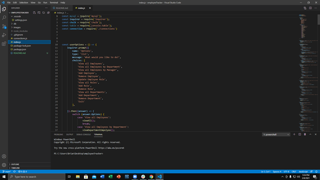
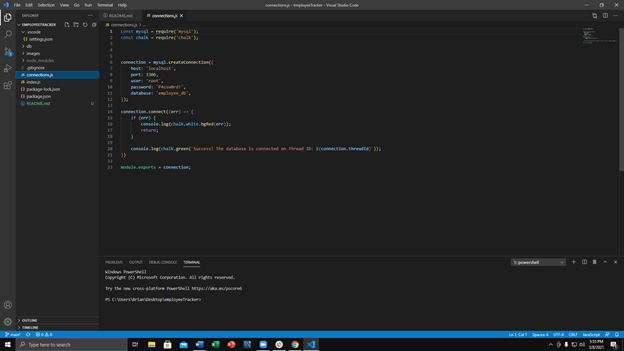
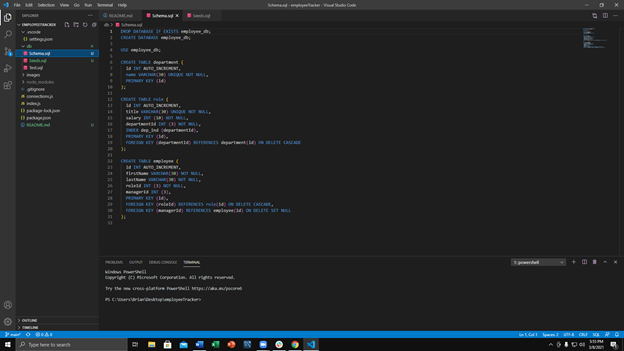
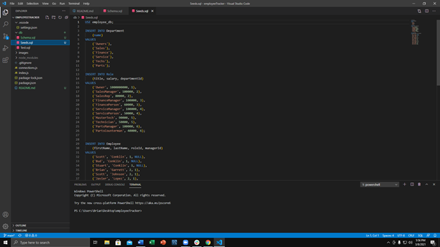

# Employee Tracker

## Purpose
    
The purpose of this activity was to create from scratch an application that a company could use to store deparment, management and employee infomation. By using MySQL and Inquirer the company should be able to add, update and remove information as needed while having all the information stored in a MySQL database. Now lets move on to the task at hand.

## Task List

<ol>
    <li> Create a Schema and a Seed for MySQL </li>
    <li> Provide three tables (Department, Role, and Employee) and Provide some start infomation to test</li>
    <li> Give the user the ability to add, remove and update th info through inquirer prompts</li>
    <li> Use MySQL, Inquirer, and Console.table somewhere in the code</li>
    <li> Commit your code updates often (which im not good at yet) </li>
    <li> Provide a functional app with clean code </li>
</ol>

## Website Deployment

The current version of this website can be found here. <a href="https://bhamm90.github.io/employeeTracker/">(Employee Tracker)</a>

## Feedback

Please get ahold of me with any suggestions for features/items you believe should be added. Also feel free to let me know of any issues you may come across while using the page. You can reach out to me on <a href="https://stackoverflow.com/users/14324130/bhamm90">Stack Overflow</a> with any comments and concerns. For any issues and fixes you can file an issue at the <a href="https://github.com/BHamm90/employeeTracker/issues">Employee Tracker Issues </a> <-- so I can fix them as soon as possible.

## Demo Video

The demo on how to use the app is provide in the demo folder. You will need a VLC player or ability to watch WEBM files.

## Preview of the JavaScript

## Preview of the MySQL

## Looking Forward

Looking forward I would like to continue updating this employeeTracker. I want to fix the issues / bugs im currently experiencing. Would like to try to tie this code to a UI for a better user experience. Maybe make the app more complex with more places for data and add extra options for the user to work with.

© 2021 Trilogy Education Services, a 2U, Inc. brand. All Rights Reserved.

